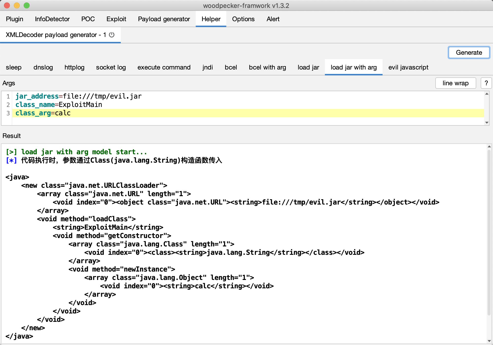

## 0x01 简介

`xmldecoder-payload-generator`是woodpecker框架快速生成XMLDecoder荷载插件,目前支持如下payload生成：

- [x] sleep
- [x] dnslog
- [x] socket log
- [x] httplog
- [x] execute command
- [x] jndi
- [x] bcel
- [x] load jar
- [x] execute javascript

## 0x02 截图

